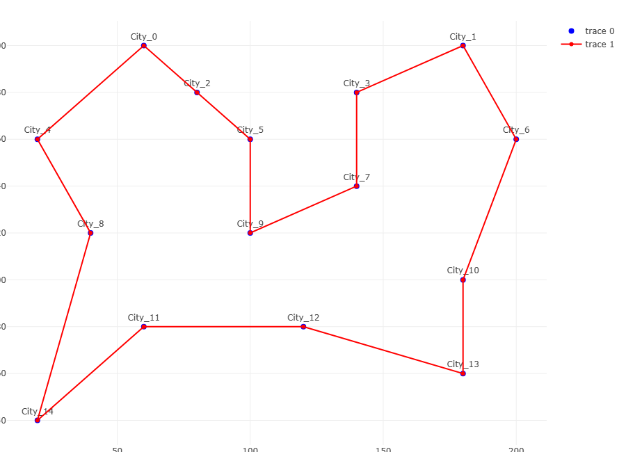
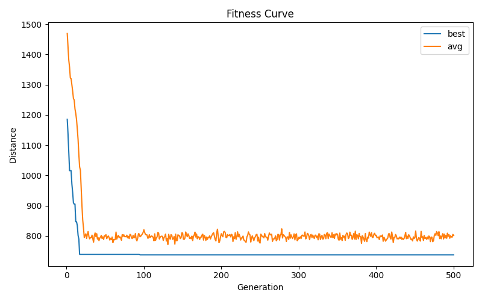
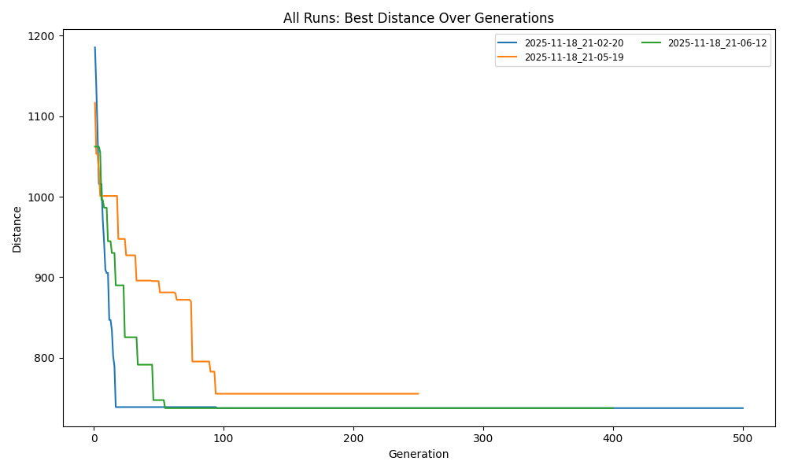

# TSP Solver Using Genetic Algorithm (With Streamlit Visualization)

This repository provides a complete and interactive solution for the **Traveling Salesman Problem (TSP)** using a **Genetic Algorithm (GA)** implemented in Python.
The project includes:

- Genetic Algorithm implementation
- Streamlit web interface
- Interactive route visualization using Plotly
- Evolution statistics (best and average fitness)
- Tabular output of the best route
- CSV export
- Support for custom datasets

---



*Figure 1: Example of the interactive TSP route visualization.*


*Figure 2: Best and average route length over generations.*


# best for now !

*Figure 3: Best fitness curve in multiple runs.*

# 1. Features

### Genetic Algorithm
- Population initialization
- Tournament selection
- Ordered Crossover (OX)
- Swap mutation
- Elitism
- Fitness based on inverse Euclidean path length

### Visualization
- Interactive route plot with Plotly
- Streamlit UI for parameter tuning
- Dynamic statistics chart
- Downloadable results

---

# 2. Problem Description (TSP)

The **Traveling Salesman Problem** is an NP-hard optimization problem.
Goal:
> Find the shortest path that visits all cities exactly once and returns to the starting point.

Since exact solutions become computationally expensive for large datasets, Genetic Algorithms are a strong heuristic for near‑optimal solutions.

---

# 3. Genetic Algorithm Workflow

### 3.1 Initialization
Random population of permutations.

### 3.2 Fitness Function
Fitness = `1 / route_distance`

### 3.3 Selection
Tournament selection (default k=3).

### 3.4 Crossover
Ordered Crossover (OX), ideal for permutations.

### 3.5 Mutation
Swap mutation with configurable probability.

### 3.6 Elitism
Best individuals transferred directly to next generation.

### 3.7 Stopping Condition
Fixed number of generations.

---

# 4. Installation

## 4.1 Clone Repository
```bash
git clone https://github.com/Drele11ven/tsp-genetic
cd tsp-genetic
```

## 4.2 Create Virtual Environment

### Linux / macOS
```bash
python3 -m venv .venv
source .venv/bin/activate
```

### Windows
```powershell
python -m venv .venv
.venv\Scripts\Activate.ps1
```

## 4.3 Install Requirements
```bash
pip install -r requirements.txt
```

---

# 5. Running the Application

```bash
cd src
streamlit run streamlit_app.py
```

The application runs at:
http://localhost:8501

---

# 6. Using the Application

1. Load demo dataset or upload your own.
2. Set GA parameters (population size, mutation rate, generations...).
3. Start the algorithm.
4. View:
   - Route visualization
   - Generation statistics
   - Best route table
5. Export CSV of final route.

---

# 7. Dataset Format

City CSV file must contain:

```
id,name,x,y
0,CityA,100,200
1,CityB,150,180
...
```

Coordinates are Cartesian (Euclidean distance used).

---

# 8. Project Structure

```
tsp-genetic/
├─ README.md
├─ requirements.txt
├─ data/
│  └─ cities_sample.csv
├─ src/
│  ├─ ga.py
│  ├─ utils.py
│  └─ streamlit_app.py
└─ plots/
```

---

# 9. References

### Books
- Goldberg — Genetic Algorithms in Search, Optimization
- De Jong — Evolutionary Computation

### Papers
- Held & Karp — Dynamic programming for TSP
- Applegate et al. — The Traveling Salesman Problem

### Tools
- Python 3
- Streamlit
- NumPy
- Plotly
- Pandas

---

# 10. License
MIT License (or add your own)

---

# 11. Contact
Open an Issue or Pull Request for improvements.
